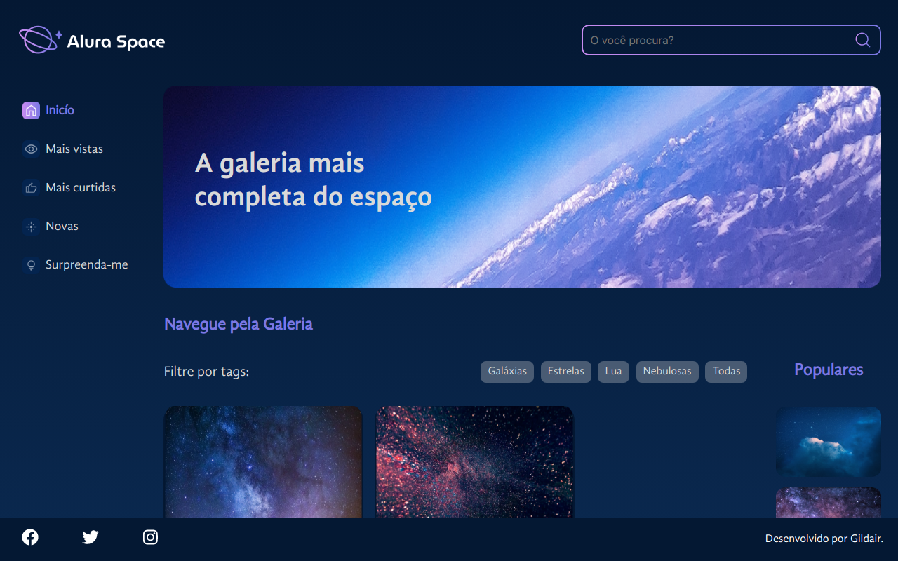

# Alura Space

Este blog é uma aplicação desenvolvida em React. 
Foi pensado para ser o primeiro projeto em contato com <b>React e Sass</b>.

## 🔨 Funcionalidades do projeto

Você pode passear <a href="https://projeto-alura-space.vercel.app/" target="_blank">no Site</a> para entender a arte conceitual do projeto. 
<b>Esse site Foi uma Landing Page em React com JavaScript </b>

## ✔️ Técnicas e tecnologias utilizadas

Se liga nessa lista de tudo que usaremos nesse Projeto:

- `React`
- `React Components`
- `React State`
- `JavaScript`
- `SASS`

E muito mais!

## 🛠️ Abrir e rodar o projeto

Para abrir e rodar o projeto, execute `npm i` para instalar as dependências e `npm start` para inicar o projeto.

Depois, acesse <a href="http://localhost:3000/">http://localhost:3000/</a> no seu navegador.
